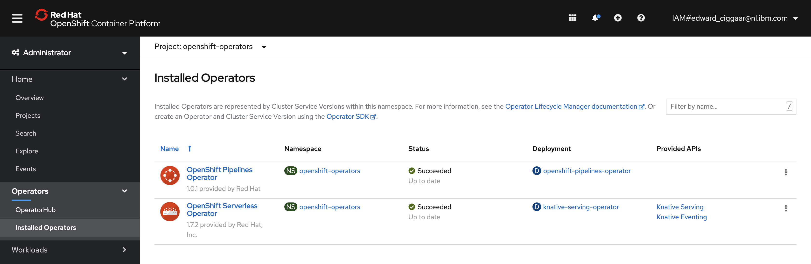
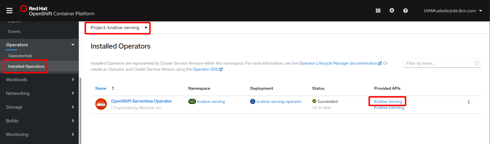
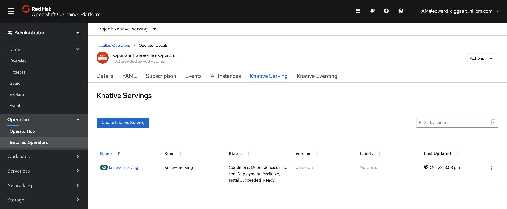
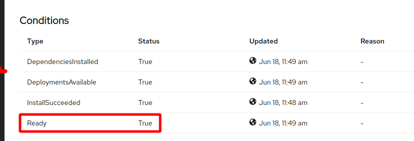

# Installing Required OpenShift Operators 

Two operators need to be installed to successfully complete this workshop, the OpenShift Serverless Operator and the OpenShift Pipelines operator. This can be done via the UI or via the command line. 


## Install using the CLI
In this section, the steps for the command line are listed. 

1. For this, switch tab to your IBM Cloud Shell session and go the root of the cloned git repository from the previous step.

   ```bash 
   $ cd ~/jfall2020-workshop/scripts
   ```

1. Next, run the following script:

   ```bash
   $ ./create-workshop-prereqs.sh
   ```
   
   the output should end with something similar to:

   ```
   {
   "lastTransitionTime": "2020-10-30T10:57:07Z",
   "message": "Dependency installing: Kourier",
   "reason": "Installing",
   "status": "False",
   "type": "Ready"
   }

   DependenciesInstalled=True
   DeploymentsAvailable=True
   InstallSucceeded=True
   Ready=True

   ==> Done!

   ==> ****************************************************
   ==> 
   ==> Successfully installed JFall 2020 workshop pre-reqs
   ==> 
   ==> ****************************************************
   ```

This script creates a subscription to both the serverless and the pipelines operator, it creates the `knative-serving` namespace and it enables the Knative Serving API.

1. When the script completed successfully, go the Web Console and check that both operators are present under 'Operators' -> Installed Operators'
   
    

1. To verify that the Knative Serving API was successfully enabled, change to the 'knative-serving' project. Make sure you're still at the 'Installed Operators' page and click on the 'Knative Serving' API.
   
   

1. This opens the following page:

   

1. Click on the Name 'knative-serving'. In the 'Overview' scroll down to Conditions. You can see all 4 conditions are true, including 'Ready':
   
   
   
   Note that the shell script reported exaclty the same status. In the 'Resources' tab you will see many deployments, services, pods, all should be 'Created' or 'Running'. 

## [Optional] Install via the Web Console

If preferred, the operators can be installed via the Web Console as well. Click [Install via UI](2-InstallKnativeUI.md) to get to the details of this.

---

__Continue with the next part [Create, change and deploy a Vert.x example app as Knative service](3-DeployKnativeService.md)__      

