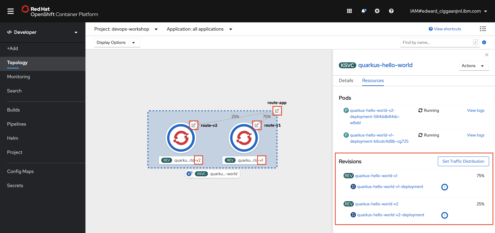

# Knative Traffic Management

In the previous section you have replaced revision v1 of the `knative-jfall-service` app with revision v2.

What if you want to do a canary release and test the new revision/version on a subset of your users?  

This is something you can easily do with Istio. It requires additional VirtualService and DestinationRule definitions.

Using pipelines and Knative it is also rather simple to accomplish this. A good approach would be to create a dedicated Pipeline Run for this. However in this lab wel will edit the pipeline directly and implicitly create a new pipeline run when starting the pipeline.

1. For this, switch tab to the IBM Cloud Shell and ensure that the `jfall-workshop` project is your current project. Then edit the pipeline by running:
    
    ```bash
    $ oc edit pipeline jfall-pipeline
    ```
    
    The pipeline opens in editing mode with vi as editor. 

1. Now, search for the string `env=TARGET` by typing `/` followed by:

    ```
    env=TARGET
    ```

    Type `n` once to go the next search result. You should now be at the following line:

    ```
    - --env=TARGET=Hello JFall 2020 v2 UPDATE!!!
    ```

1. Switch to editing mode and add the following lines

    ```
    - --env=TARGET=Hello JFall 2020 v2 UPDATE!!!
    - --tag=knative-jfall-service-v1=v1
    - --tag=knative-jfall-service-v2=v2
    - --traffic=v1=75
    - --traffic=v2=25
    ```

    Furthermore, change `create` into `update` and remove the `--force` flag, so that the `ARGS` paramter Knative client invocation looks like:

    ```
    - name: ARGS
      value:
        - service
        - update
        - knative-jfall-service
        - --image=$(resources.inputs.input-image.url)
        - --revision-name=knative-jfall-service-v2
        - --env=TARGET=Hello JFall 2020 v2 UPDATE!!!
        - --tag=knative-jfall-service-v1=v1
        - --tag=knative-jfall-service-v2=v2
        - --traffic=v1=75
        - --traffic=v2=25
    ```

    Those additional 4 lines of code -- with the `tag` and `traffic` entries -- will create a 75% / 25% distribution between revisions `-v1` and `-v2`.

1. Finally, save your changes by pressing `<Esc>`, followed by type `:wq`. You should see the following output:

    ```
    pipeline.tekton.dev/jfall-pipeline edited
    ```

1. Use the Tekton CLI to run the pipeline again:

    ```bash
    $ tkn pipeline start jfall-pipeline
    ```

    Accept the defaults again and check the logs or monitor the deployment via the Web Console. Wait for it to successfully complete.
   
1. In the OpenShift Web Console Topology view you can see that now both revisions are activated, v1 with 75 %, v2 with 25 %.
   
    

    With "Set Traffic Distribution" you can actually change the distribution without modifying and redeploying the YAML file.

1. Open the Route in your Browser and click refresh multiple times. You will see output of both revisions, `v1` will show up more often than `v2` though (75 % vs. 25 %).

    Back in the Topology view, you can see pods for both revisions are started.
   
---

__Continue with the next part [Knative Auto-Scaling](6-Scaling.md)__
