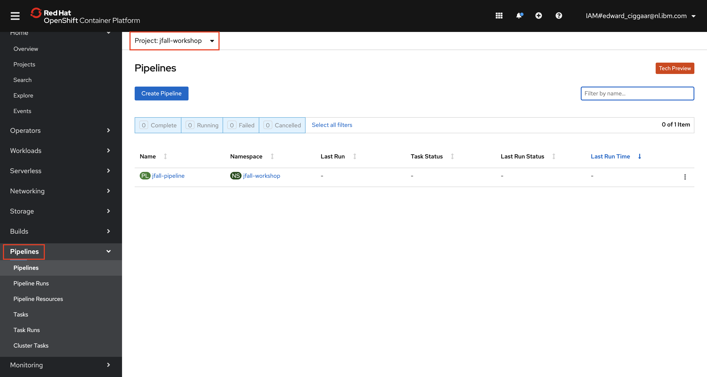
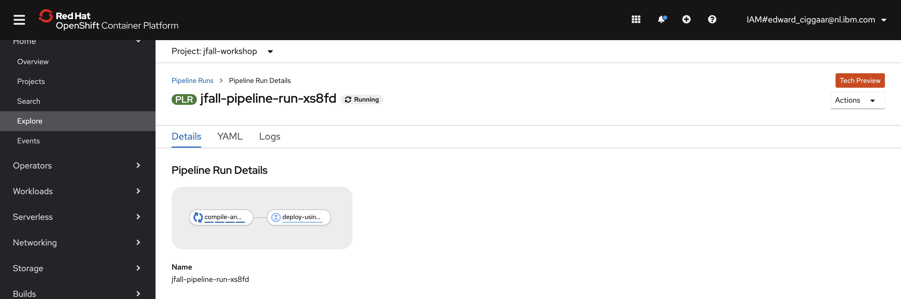
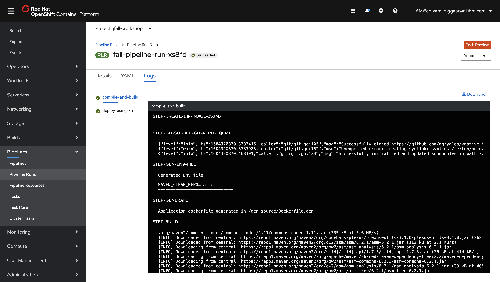
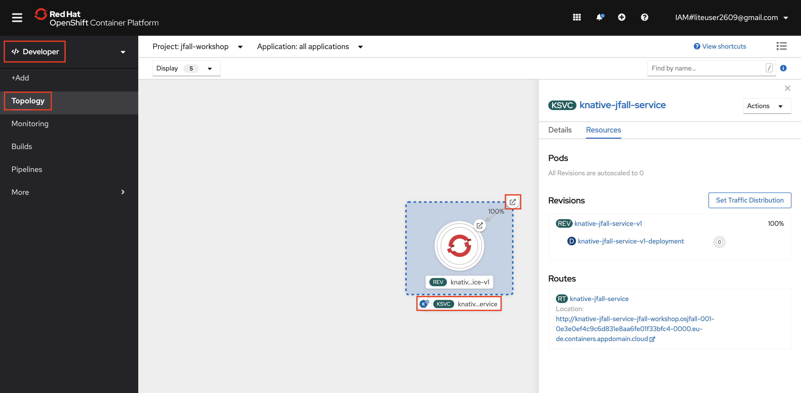
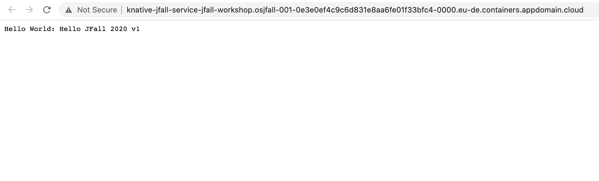
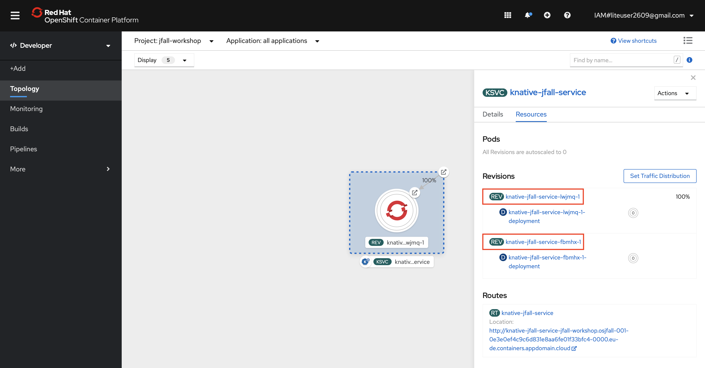

# Create an OpenShift pipeline and deploy your Vert.x app with it

## Creating the pipeline

A pipeline consists of multiple so-called tasks that are executed in sequence and/or parallel. Tasks in their turn can contain one ore more steps. To get our code deployed to OpenShift, a couple of steps need to be executed. First, we need to run a Maven build of our Java code. Next, a Docker image needs to be created containing the runnable JAR. Finally, this Docker image needs to be deployed to the OpenShift cluster as a Knative service. 

The first two steps are put together into one Pipeline Task called `compile-and-build`. The deployment of the Knative service is performed by a seperate task called `deploy-using-kn`. This task consists of just one step. 

Both tasks use so-called Pipeline Resources that serve as input and output for the task. The `compile-and-build` task needs a Git repo as input. It produces a Docker image as output. The second and final task will use this Docker image as input again. Besides these Pipeline resource both tasks use parameters as well to control how the tasks are run. 

All these resources are grouped together in what is called an OpenShift pipeline. Take a look at the YAML below. 

```yaml
apiVersion: tekton.dev/v1beta1
kind: Pipeline
metadata:
  name: jfall-pipeline
  namespace: jfall-workshop
spec:
  resources:
    - name: source-git
      type: git
    - name: output-image
      type: image
  tasks:
    - name: compile-and-build
      params:
        - name: PATH_CONTEXT
          value: code
        - name: TLSVERIFY
          value: 'false'
        - name: MAVEN_CLEAR_REPO
          value: 'false'
      resources:
        inputs:
          - name: source
            resource: source-git
        outputs:
          - name: image
            resource: output-image
      taskRef:
        kind: Task
        name: compile-and-build
    - name: deploy-using-kn
      params:
        - name: kn-image
          value: 'gcr.io/knative-releases/knative.dev/client/cmd/kn:latest'
        - name: ARGS
          value:
            - service
            - create
            - knative-jfall-service
            - --image=$(resources.inputs.input-image.url)
            - --revision-name=knative-jfall-service-v1
            - --env=TARGET=Hello JFall 2020 v1
            - --force
      resources:
        inputs:
          - name: input-image
            resource: output-image
      runAfter:
        - compile-and-build
      taskRef:
        kind: Task
        name: deploy-using-kn
```

This YAML describes the pipeline that is used in this workshop. Note how it is built up, referencing the tasks that are used, the pipelines resources, etc.

1. To create this pipeline in your own environent, switch tab to your IBM Cloud Shell. Then, change directory to `jfall2020-workshop/scripts`.

    ```bash
    $ cd ~/jfall2020-workshop/scripts
    ```
    Make sure the `jfall-workshop` project is your active project:
    
    ```bash
    $ oc project jfall-workshop
    ```
    
    and run the following script:

    ```bash
    $ ./create-pipeline.sh
    ```

  This script creates the pipeline resources, tasks and the pipeline itself -- all in the `jfall-workshop` project. The output should be similar to:

```
==> **************************************************
==> 
==> Create JFall 2020 workshop pipeline
==> 
==> **************************************************

==> Creating Pipeline Resources for Git repo and target Docker image
pipelineresource.tekton.dev/git-repo created
pipelineresource.tekton.dev/image-source created
==> Done!

==> Creating Pipeline Tasks
task.tekton.dev/compile-and-build created
task.tekton.dev/deploy-using-kn created
==> Done!

==> Creating Tekton Pipeline 
pipeline.tekton.dev/jfall-pipeline created
==> Done!

==> ****************************************************
==> 
==> Successfully created JFall 2020 workshop pipeline
==> 
==> ****************************************************
```

To verify that everything is in place, check the Pipelines section in the OpenShift Web Console. It should list the Jfall pipeline, resources and  tasks created by the script.

 

You can also check the presence of the resources using the command line. For this,

2. In your IBM Cloud shell use the Tekton CLI to get a list of your pipelines resources:
  
    ```bash
    $ tkn resource list
    ```
    Similar, for the tasks:

    ```bash
    $ tkn task list
    ```
    and finally, for the pipeline itself, execute the following command:
    
    ```bash
    $ tkn pipeline list
    ```

## Running the pipeline

Having successfully created all pipeline resources, we can now run the pipeline. 

1. For this, enter:

    ```bash
    $ tkn pipeline start jfall-pipeline
    ```

    Accept the defaults for the git repo and the image source. The result should be similar to:

    ```bash
    $ tkn pipeline start jfall-pipeline
    ? Choose the git resource to use for source-git: git-repo (https://github.com/eciggaar/jfall2020-workshop.git)
    ? Choose the image resource to use for output-image: image-source (image-registry.openshift-image-registry.svc:5000/jfall-workshop/jfall-image:latest)
    PipelineRun started: jfall-pipeline-run-xs8fd

    In order to track the PipelineRun progress run:
    tkn pipelinerun logs jfall-pipeline-run-xs8fd -f -n jfall-workshop
    ```

1. As mentioned by the output, you can monitor the progress of the pipeline run as follows:

    ```bash
    $ tkn pipelinerun logs jfall-pipeline-run-xs8fd -f -n jfall-workshop
    ```

    Note that your pipeline run name is different from the one shown above. Also, it may take a little bit before logs are being shown here...

    You can also monitor the progress of your deployment using the OpenShift Web Console. 

1. For this, open the Web Console. In the Pipelines -> Pipeline Runs section you find your running pipeline. Typically, you would see something like:

     

    Click on one of the tasks to get to the details of the Task Run. Below the result is shown when clicking the `compile-and-build` task.

     

    As you might have noticed, by the time this screenshot was taken, the Pipeline Run successfully completed. 

## So what got deployed? :smiley:

At this point we deployed our Vert.x java application to Openshift using a pipeline. Let's have a look at the application. For this,

1. Switch tab to the OpenShift Web Console, open the 'Developer' view and select 'Topology'. Make sure the 'jfall-workshop' project is selected.

     

    Now click the KSVC tag to view the details (pods, revisions, routes, etc.) of the Knative service. Click the route to open the application. The result should be similar to 

     

### Knative Revisions

A Knative Revision is a specific version of a code deployment. 

If you deploy a new version of an app in Kubernetes, you typically change the deployment.yaml file and apply the changed version using `kubectl`. Kubernetes will then perform a rolling update from the old to the new version.

Let's do a new deployment of our hello world Vert.x app. Just to make life easy, we only gonna change the value of the `TARGET` environment variable that is used as parameter in the `deploy-using-kn` task. For this,

1. Switch tab to the IBM Cloud Shell. Make sure `jfall-workshop` is your current project. Then edit the pipeline by running:

    ```bash
    $ oc edit pipeline jfall-pipeline
    ```

    The pipeline opens in editing mode with vi as editor. 

1. Now, search for the string `env=TARGET` by typing `/` followed by:

    ```
    env=TARGET
    ```

    Type `n` once to go the next search result. You should now be at the following line:

    ```
    - --env=TARGET=Hello JFall 2020 v1
    ```

1. Next, type `<SHIFT> + a` (so captical A). You should now be in editing mode and at the end of the line. Make a change to the value of `TARGET`, e.g.

    ```
    - --env=TARGET=Hello JFall 2020 v2 UPDATE!!!
    ```

1. A couple of lines above change the `revision-name` to:

    ```
    - --revision-name=knative-jfall-service-v2
    ```

1. Finally, save your changes by pressing `<Esc>`, followed by type `:wq`. You should see the following output:

    ```
    pipeline.tekton.dev/jfall-pipeline edited
    ```

1. Use the Tekton CLI to run the pipeline again:

    ```bash
    $ tkn pipeline start jfall-pipeline
    ```

    Accept the defaults again and check the logs or monitor the deployment via the Web Console. Wait for it to successfully complete.

1. Next, check the Knative service by typing:

    ```bash
    $ kn service describe knative-jfall-service
    ```

    the output should be similar to:

    ```
    Name:       knative-jfall-service
    Namespace:  jfall-workshop
    Age:        25m
    URL:        http://knative-jfall-service-jfall-workshop.osjfall-001-0e3e0ef4c9c6d831e8aa6fe01f33bfc4-0000.eu-de.containers.appdomain.cloud

    Revisions:  
      100%  @latest (knative-jfall-service-v2) [2] (49s)
            Image:  image-registry.openshift-image-registry.svc:5000/jfall-workshop/jfall-image:latest (pinned to a07469)

    Conditions:  
      OK TYPE                   AGE REASON
      ++ Ready                  42s 
      ++ ConfigurationsReady    43s 
      ++ RoutesReady            42s 
    ```

    Note that the `[2]` indicates that we currently have two revisions and in this case 100% load on the `knative-jfall-service-v2` revision.

1. Back in the OpenShift Web Console, Topology view:

    

    It hasn't changed a lot, but notice the two revisions in the 'Resources' where revision `knative-jfall-service-v2` has 100%. Its the same 100% we could see in the previous step using the Knative CLI.

1. Click on the Route, this will display the output of the latest revision ("Hello: Hello JFall 2020 v2 UPDATE!!!")

    Back in the Web Console, a pod will be started for Revision `knative-jfall-service-v2`. It will scale to zero after a moment. 

---

__Continue with the next part [Knative Traffic Management](5-TrafficManagement.md)__

